# Card Notifier

Card Notifier is a web application that helps you track and receive notifications for credit card transactions. It processes transaction emails, extracts relevant information using AI, and sends push notifications to your client when new transactions are detected.

## Features

- OAuth authentication
- Email processing for card transactions
- AI-powered transaction extraction
- Push notifications for new transactions
- Transaction history and weekly summaries
- Email address management for receiving transactions

## Architecture

```mermaid
architecture-beta
    group Cloudflare(logos:cloudflare-icon)[Cloudflare]
    service EmailRouting(mdi:email-fast-outline)[Email Routing] in Cloudflare
    service DB(mdi:database)[D1] in Cloudflare
    service Workers(mdi:server)[Workers] in Cloudflare
    service WorkersAI(mdi:brain)[Workers AI] in Cloudflare

    group ExternalServices[External Services]
    service AuthService(mdi:key)[Auth Service] in ExternalServices
    service MailService(mdi:email-multiple-outline)[Mail Service] in ExternalServices
    service WebPushService(mdi:bell-circle-outline)[Web Push Service] in ExternalServices

    Workers:L -- R:DB
    Workers:L -- R:WorkersAI
    EmailRouting:T -- B:Workers
    AuthService:T -- B:Workers
    MailService:T -- B:EmailRouting
    Workers:L -- R:WebPushService
```



## Getting Started

### Prerequisites

- [Node.js](https://nodejs.org/) (v18 or later)
- [Wrangler CLI](https://developers.cloudflare.com/workers/wrangler/install-and-update/)
- Cloudflare account with access to Workers, D1, and Email Routing

### Local Development

1. Clone the repository

2. Install dependencies:
   ```bash
   npm install
   ```

3. Create a `.dev.vars` file with the following environment variables:
   ```
    # Create them with `npx web-push generate-vapid-keys` command.
    WEB_PUSH_PUBLIC_KEY=
    WEB_PUSH_PRIVATE_KEY=
   
    # https://github.com/honojs/middleware/tree/main/packages/oidc-auth#configuration
    OIDC_AUTH_SECRET=
    OIDC_ISSUER=
    OIDC_CLIENT_ID=
    OIDC_CLIENT_SECRET=

    # For creating a new email routing
    ## https://developers.cloudflare.com/fundamentals/api/get-started/account-owned-tokens/
    ### Rules: Zone:Email Routing Rule/Edit, Zone:Zone Setting/Read, Zone:Zone/Read
    CF_ACCOUNT_TOKEN=
    ## https://developers.cloudflare.com/fundamentals/account/find-account-and-zone-ids/#copy-your-zone-id
    CF_ZONE_ID=
    CF_WORKER_NAME=
    ## placeholder: $email (e.g. `card-notifier-$email@example.info`)
    CF_EMAIL_TEMPLATE=
   ```

4. Create a local D1 database:
   ```bash
   wrangler d1 create card-notifier
   ```

5. Run migrations:
   ```bash
   npm run generate:migration
   npm run local:migration
   ```

6. Start the development server:
   ```bash
   npm run dev
   ```

7. For testing email processing locally:
   ```bash
   npm run preview # or npx wrangler dev
   npm run local:email
   ```

### Deployment

1. Deploy the application to Cloudflare:
   ```bash
   npm run deploy
   ```

2. Set up email routing in the Cloudflare dashboard:
   - Make sure your domain has proper MX records set up

3. Set up environment variables in the Cloudflare dashboard:
   - Go to your Worker settings
   - Add the same environment variables as in your `.dev.vars` file

4. Run migrations on the production database:
   ```bash
   npm run remote:migration
   ```

## Scripts

- `npm run build`: Build the application
- `npm run deploy`: Build and deploy to Cloudflare
- `npm run dev`: Start development server
- `npm run preview`: Build and preview locally
- `npm run generate:migration`: Generate database migration files
- `npm run local:migration`: Apply migrations to local database
- `npm run remote:migration`: Apply migrations to production database
- `npm run local:email`: Test email processing locally
- `npm run generate:pwa-assets`: Generate PWA assets from logo.svg
